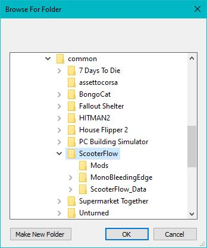

Mod files -> [SFToolKit.zip](https://github.com/AcedWorld/SFToolKit/releases/latest)

Jump higher:

NormalHopSettings - Normal Strenght

LowHopSettings - Low Strenght 

Do tricks faster:

Anim Speed

Do 360's faster:

Spin Speed

Push faster:

Max Motor Torque 

Initial Push Force

Pump faster:

Pump Force

This Tool-Kit will be updated with all the changeable options that I can find in the game.
Some features won't change much that you can see in the game.
I still need to go through and work out what is useful and what is not.
So far I have seen that you can have super speed, super jump and do tricks faster.
I will make another menu in the future that only has useful options that are easier to use.
Message me if you discover anything really cool that you can do with certain settings applied.

Installation guide below.

#### Step 1
Download [Unity Mod Manger](https://github.com/AcedWorld/SFToolKit/releases/download/UMM/ScooterFlowUnityModManager.zip)

#### Step 2
Extract UnityModManger.zip
#### Do not extract UnityModManger.zip into the ScooterFlow game folder. Extract it on your desktop instead.

#### Step 3
Right click UnityModManager.exe and Run As Administrator.
#### Step 4

1: Update UnityModManager by clicking on the green download button.
2: Make sure "Game" is set to ScooterFlow and the "Folder" is set to where you have ScooterFlow installed.
Example: \steamapps\common\ScooterFlow
#### Make sure you select the ScooterFlow folder and not just the common folder.

#### If you don't know where you have scooter flow installed go to the game in your steam libary then 
click "The Gear Icon"
click "Manage"
click "Browse local files"

#### Step 5
Press the install button in UnityModManager.

### Step 6
Switch to the "Mods" tab in UnityModManager.
Drag and drop the latest [SFToolKit.zip](https://github.com/AcedWorld/SFToolKit/releases/latest) (or any other mod you're trying to install) into the "Drop zip files here" box.

### Step 7
Press on "Check Updates" to see if there is an update for the mod.
If status says "Ok" there is no update.
If status says "Download" right click the mod then press on "Update to".

### Step 8
Switch to the "Settings" tab in UnityModManager.
Set "Check Updates" to "Everytime"

### Step 9
Start the game ScooterFlow from your steam libary.
When the game is loading you should see the UnityModManager in-game menu open.
You can use Ctrl+F10 to open and close.
Make sure the status is a green circle.
If there in an "Available Update" ico you need to open UnityModManager.exe and do an update for the SFToolKit mod then restart the ScooterFlow game.

### Step 10
Once you're on a map you can open the SFToolKit from the top left of the screen.
Opening it on the ScooterFlow main menu will say a lot of things are not found until you load into a map.

